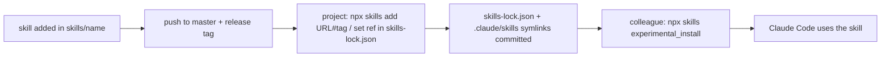

# Magento Developer Skills

## General Information

[Claude Code](https://docs.claude.com/en/docs/claude-code) skills for Magento 2 projects running
on ddev. Skills are installed per project with the
[skills CLI](https://github.com/vercel-labs/skills) and committed into the project, so teammates
and CI need no access to this repository.

## Features

| Skill | What it does |
|---|---|
| `magento-phpstan-check` | runs phpstan on the project or the changed files and fixes the findings |
| `magento-phpmd-check` | runs phpmd with the Magento ruleset and triages the violations |
| `magento-performance-review` | reviews the working diff for Magento performance anti-patterns |
| `query-count-audit` | A/B SQL query count on homepage, PLP and PDP |
| `call-count-audit` | A/B PHP function call count on homepage, PLP and PDP |

Skill sets with extra setup:

- [Pre-commit gate](docs/pre-commit-gate.md) — the five skills above plus a hook that blocks
  `git commit` until all of them pass

## Configuration

Skills are pinned to a release tag, like `composer.lock` pins packages. From the project root
(the `.claude/` folder must exist):

```bash
# list the skills of a release
npx skills add https://github.com/avkozyr/magento-commit-gate-claude.git#v1.0.0 --list

# add skills pinned to a release (all, or name them instead of '*')
npx skills add https://github.com/avkozyr/magento-commit-gate-claude.git#v1.0.0 --skill '*' -y
```

The CLI stores the files in `.agents/skills/<name>/`, links `.claude/skills/<name>` to them and
records source and `ref` (the tag) in `skills-lock.json`. Use the full git URL: the
`owner/repo#tag` shorthand is rejected.

Commit `skills-lock.json` and the `.claude/skills/<name>` symlinks; ignore the files:

```gitignore
/.agents
```

After cloning, or after someone changed the lock — the equivalent of `composer install`:

```bash
npx skills experimental_install
```

It installs every skill at the ref in the lock into `.agents/skills/`; the committed symlinks
make them visible to Claude Code.

Optional — restore on every `composer install` (skipped in CI and without `npx`, never fails
composer):

```json
"scripts": {
    "skills-install": [
        "[ -n \"$CI\" ] || ! command -v npx >/dev/null || DISABLE_TELEMETRY=1 npx -y skills experimental_install || echo 'skills install failed, run: npx skills experimental_install'"
    ],
    "post-install-cmd": ["@skills-install"]
}
```

Move to another release: set `"ref"` of the skills in `skills-lock.json` to the new tag, run
`npx skills experimental_install`, commit the lock. (`npx skills update` keeps the pinned ref.)

Some skill sets need a one-time setup step — see their doc.

Set `DISABLE_TELEMETRY=1` to stop the CLI from sending anonymous usage data.

## Technical Details

Adding a skill:

- One folder per skill: `skills/<name>/SKILL.md` with YAML frontmatter `name` (same as the folder)
  and `description` (what it does and when Claude should use it)
- Bundled scripts and files go inside the skill folder (e.g. `skills/<name>/scripts/`); they are
  installed with the skill, executable bits are kept. Refer to them by their installed path
  `.claude/skills/<name>/…`
- Generic for our ddev setup: run PHP/Magento commands via `ddev exec`, read project values from
  ddev (`DDEV_HOSTNAME`, `DDEV_PHP_VERSION`) or a committed `.claude/<skill>.conf` — never hardcode
  a project's URLs, SKUs, paths or store codes
- Shell scripts over PHP code; no composer dependency
- Docs that should not be installed into projects go in `docs/`

## Workflow Diagram


