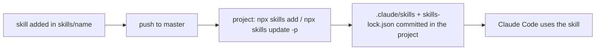

# Magento Developer Skills

## General Information

[Claude Code](https://docs.claude.com/en/docs/claude-code) skills for Magento 2 projects running
on ddev. Skills are installed per project with the
[skills CLI](https://github.com/vercel-labs/skills) and committed into the project, so teammates
and CI need no access to this repository.

## Features

| Skill | What it does |
|---|---|
| `magento-phpstan-check` | runs phpstan on the project or the changed files and fixes the findings |
| `magento-phpmd-check` | runs phpmd with the Magento ruleset and triages the violations |
| `magento-performance-review` | reviews the working diff for Magento performance anti-patterns |
| `query-count-audit` | A/B SQL query count on homepage, PLP and PDP |
| `call-count-audit` | A/B PHP function call count on homepage, PLP and PDP |

Skill sets with extra setup:

- [Pre-commit gate](docs/pre-commit-gate.md) — the five skills above plus a hook that blocks
  `git commit` until all of them pass

## Configuration

From the project root:

```bash
# list the skills in this repository
npx skills add avkozyr/magento-commit-gate-claude --list

# install all skills
npx skills add avkozyr/magento-commit-gate-claude --skill '*' -a claude-code -y

# install selected skills
npx skills add avkozyr/magento-commit-gate-claude --skill magento-phpstan-check -a claude-code -y

# update installed skills to the latest version
npx skills update -p
```

The CLI copies each skill into `.claude/skills/<name>/` and records the source in
`skills-lock.json`. Commit `skills-lock.json` (used by `npx skills update`) and add the installed
skill folders to the project's `.gitignore`; every developer runs the install command once after
cloning. Some skill sets need a one-time setup step — see their doc.

`npx skills experimental_install` (restore from the lock) installs into `.agents/skills/`, which
Claude Code does not read — use `npx skills add … -a claude-code` instead.

Set `DISABLE_TELEMETRY=1` to stop the CLI from sending anonymous usage data.

## Technical Details

Adding a skill:

- One folder per skill: `skills/<name>/SKILL.md` with YAML frontmatter `name` (same as the folder)
  and `description` (what it does and when Claude should use it)
- Bundled scripts and files go inside the skill folder (e.g. `skills/<name>/scripts/`); they are
  installed with the skill, executable bits are kept. Refer to them by their installed path
  `.claude/skills/<name>/…`
- Generic for our ddev setup: run PHP/Magento commands via `ddev exec`, read project values from
  ddev (`DDEV_HOSTNAME`, `DDEV_PHP_VERSION`) or a committed `.claude/<skill>.conf` — never hardcode
  a project's URLs, SKUs, paths or store codes
- Shell scripts over PHP code; no composer dependency
- Docs that should not be installed into projects go in `docs/`

## Workflow Diagram


