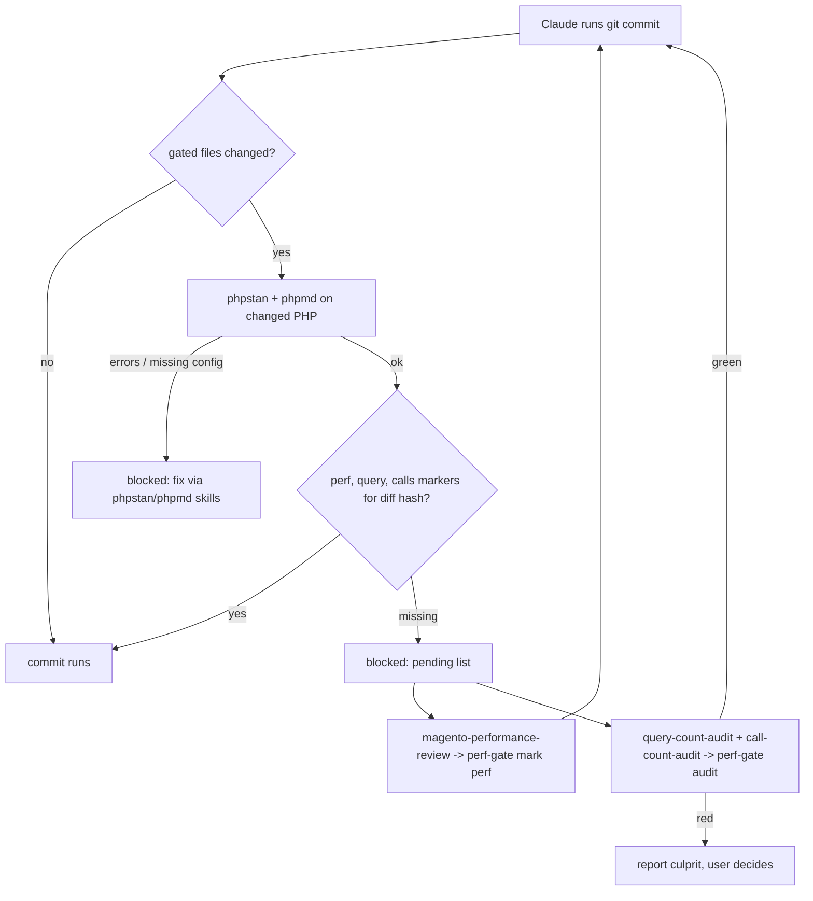

# Pre-commit Gate

## General Information

Five skills of this repository form a pre-commit gate: when Claude runs `git commit`, a hook
blocks the commit until the working diff has passed every gate.

| Gate | Skill | How it passes |
|---|---|---|
| phpstan on changed PHP/PHTML | `magento-phpstan-check` | hook runs it, must be clean |
| phpmd on changed PHP/PHTML | `magento-phpmd-check` | hook runs it, must be clean |
| performance review of the diff | `magento-performance-review` | `perf-gate mark perf` after the review |
| SQL query count A/B | `query-count-audit` | `perf-gate audit`: queries green |
| PHP function call count A/B | `call-count-audit` | `perf-gate audit`: calls green |

Counts, not timings: the same code with the same cache procedure gives the same query and call
count on any machine under any load, so a regression shows as a number that went up.

## Features

- Five skills and one shell script (`skills/magento-performance-review/scripts/perf-gate`)
- Hook blocks `git commit` (also `git -C … commit`, chained commands) until phpstan and phpmd are
  clean on the changed files and the `perf`, `query` and `calls` markers exist for the current diff
- Gated files: PHP/PHTML in `app/code` + `app/design`, module config XML
  (`app/code/**/etc/**/*.xml`: di.xml plugins, events.xml observers, …) and layout XML
- One A/B audit run (`perf-gate audit`, ~4 min): stash, rebuild, measure, restore; queries and
  calls from the same requests; teardown always (also on error / Ctrl-C); culprits printed on a
  degradation (added SQL statements, functions called more often)
- Base URL and PHP version read from ddev — a project only configures three page paths
- Missing `phpstan.neon` or phpmd ruleset blocks the commit with a clear message — no silent skip

## Configuration

Install the five gate skills (see the [README](../README.md) for the skills CLI basics), then
activate the gate once per project:

```bash
npx skills add avkozyr/magento-commit-gate-claude \
  --skill magento-phpstan-check magento-phpmd-check magento-performance-review query-count-audit call-count-audit \
  -a claude-code -y
.claude/skills/magento-performance-review/scripts/perf-gate install
```

`perf-gate install` creates `.claude/perf-gate.conf` and registers the hook in
`.claude/settings.json` (via `jq`; without `jq` it prints the entry to add).

Fill in `.claude/perf-gate.conf`:

| Key | Required | Meaning |
|---|---|---|
| `PAGE_HOME` | yes (default `/`) | homepage path |
| `PAGE_PLP` | yes | a category/listing page path, e.g. `/<category-url>` |
| `PAGE_PDP` | yes | a product page path, e.g. `/<product-url>` |
| `BASE_URL` | no | override; default = first ddev hostname answering 200 over https on `PAGE_HOME` |
| `PHP_VERSION` | no | override; default = ddev `DDEV_PHP_VERSION` |

Commit `.claude/perf-gate.conf` and `.claude/settings.json`; gitignore `skills-lock.json`,
`.agents` and the five installed skill paths (see the [README](../README.md)). Each developer installs the skills once after cloning (the
`npx skills add` command above — `perf-gate install` is only needed once per project).

Update to the latest version: `npx skills update -p`.

Requirements: ddev project, `phpstan.neon` (or `.dist`) in the project root, phpstan and phpmd
in `vendor/bin`, `python3` on the host (hook input parsing).

## Technical Details

`perf-gate <command>` (path: `.claude/skills/magento-performance-review/scripts/perf-gate`):

- `install` — creates the conf, registers the hook. Idempotent.
- `hook` — PreToolUse/Bash hook. Runs phpstan/phpmd through `ddev exec` on the changed PHP files
  (phpmd ruleset from `dev/tests/…` or `vendor/magento/magento2-base/dev/tests/…`), then requires
  `.git/.claude-{perf,query,calls}-ok-<diff hash>`. Markers for any other hash are deleted.
  Exit 2 = blocked, with the list of what is pending.
- `files [--php]` / `hash` — gated file list / 12-char hash of the gated `git diff HEAD`.
- `mark perf|query|calls` — writes the marker for the current hash. Must run in its own Bash
  call before the commit: the hook runs before the command.
- `audit` — A = `git stash push -u -- app/code app/design`, B = stash pop (diff hash verified).
  Per side `setup:di:compile` + `cache:flush`, per page 2 warmups and one measured request with
  a fresh cache-buster and `XDEBUG_TRIGGER=1`. Query log + Xdebug profiler (trigger mode) are
  enabled for the run only. All Magento CLI calls run with `XDEBUG_MODE=off` (with xdebug on,
  CLI PHP waits for an IDE forever); fpm restarts via `supervisorctl`; xdebug returns to its
  previous state. Each metric that is green on all pages gets its marker. Exit 0 = both green or
  nothing to audit, 1 = degradation, 2 = setup error.
- `measure …` — internal, runs in the ddev web container (awk + zcat). Artifacts stay in the
  container at `/tmp/perf-gate/` until the next run; compile logs in `var/perf-gate/`.

Degradation history (only on degradation): `docs/Performance/History-Queries.md` and
`docs/Performance/History-Calls.md`, written by the audit skills.

Known limitation: a page whose query count varies between identical runs (e.g. batched swatch
lookups on a PLP) can hide or fake a ±1 difference — pick stable pages for the conf.

## Workflow Diagram


